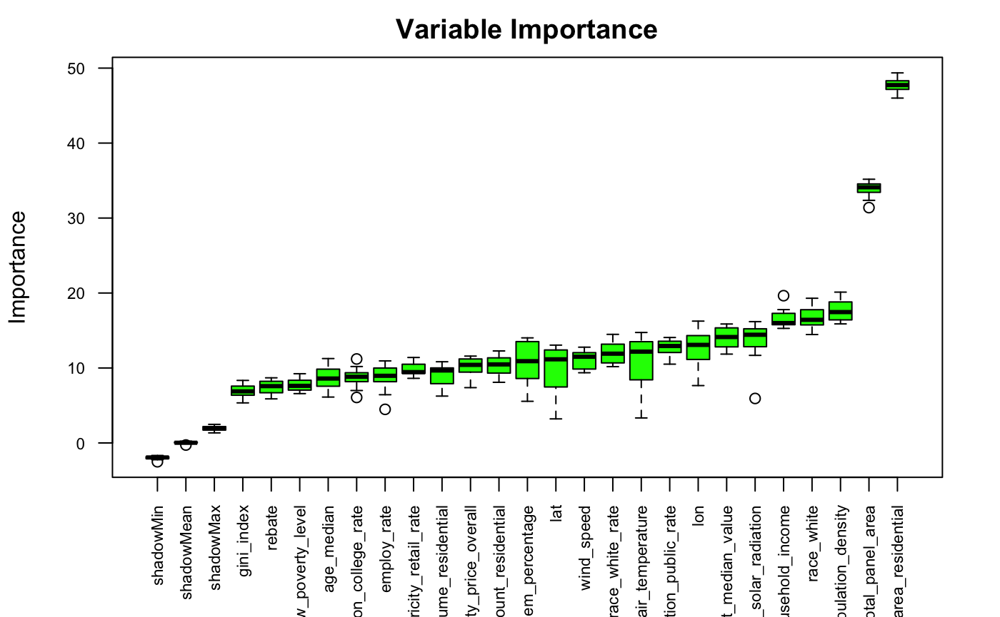

```{r setup, include=FALSE}
knitr::opts_chunk$set(echo = FALSE, warning = FALSE, results  = 'hide', message = FALSE)
```

## Introduction
The progression of Global Warming has led to an increased awareness of where energy is sourced and how it is used. At the same time, increased focus on social inequality and unequal access to resources such as grants and subsidy programs has resulted in increased scrutiny of development programs and their implementation. It has been difficult up to now to generate reliable data regarding the widespread installation and usage of  residential photovotaic (PV) systems. The DeepSolar project, carried out by Stanford's Sustainable Systems and Magic laboratories used a deep learning algorithm to process satellite imagery of residential areas, identify photovoltaic solar installations, and develop useful statistics through an analysis of the results of this process. The lab then joined this information with social data from the 2015 American Community Survey (ACS) and various other sources to create a dataset complete with statistics around PV systems and social statistics of the surrounding communities. The dataset can be found [here](http://web.stanford.edu/group/deepsolar/deepsolar_tract.csv).

In this project, I utilize the data in this dataset to train several machine learning regression models to predict the total number of photovoltaic systems contained within a census tract.


```{r eval = T, echo = F}
library(tidyverse)
library(tidymodels)
library(ggplot2)
library(dplyr)
library(corrr)
library(corrplot)
library(reshape2)
library(Boruta)
library(rpart.plot)
library(vip)
library(randomForest)
library(xgboost)
tidymodels_prefer()


deepSolarData <- read.csv("data/deepsolar_tract.csv")
dim(deepSolarData)

```
## Exploratory Data Analysis (EDA)

The Deep Solar dataset has 72537 observations and 169 variables. Since the dataset has 168 predictors, we will perform an initial analysis to determine which factors have the highest magnitude of correlation, and which variables have the greatest effect on the number of solar systems present in a census tract.


#### Distribution of Outcome Variable

First, we will perform a quick exploration of the variable we will be predicting - "solar_system_count", the number of solar systems installed in a census tract. 

```{r eval = T}
pvSysCount <- deepSolarData$solar_system_count

min(pvSysCount)
sum(pvSysCount == 0)
sum(pvSysCount == 0)/dim(deepSolarData)[1]

max(pvSysCount)
mean(pvSysCount)
median(pvSysCount)
sum(pvSysCount != 0)

hist(pvSysCount, ylim = c(0,33000), xlim = c(0,200), breaks = 1000, xlab = "Number of PV Systems installed per Tract")
```

The minimum number of PV systems installed in a census tract is 0 systems, and the highest is 1535 systems. There are 16279 census tracts with 0 solar panels installed out of 72537 total tracts, giving a percentage of 22.4% of census tracts with absolutely no PV systems installed. The average value for solar_system_count across all census tracts is 20.22. The distribution of the variable is heavily skewed to the left with a long right tail. 


## Marginal relationships between predictors and outcome variables

In order to visualize the relationships between individual predictors and the response variable, we can plot the values of the predictors against the values of the outcome.

```{r  echo = F}
# variables to select: 
vars <- c("solar_system_count",
"average_household_income",
"county",
"gini_index",
"population_density",
"poverty_family_below_poverty_level",
"race_white",
"education_college_rate",
"race_white_rate",
"employ_rate",
"electricity_price_overall",
"electricity_consume_residential",
"housing_unit_median_value",
"lat",
"lon",
"air_temperature",
"daily_solar_radiation",
"wind_speed",
"transportation_public_rate",
"age_median",
"voting_2016_dem_percentage",
"incentive_count_residential",
"rebate",
"avg_electricity_retail_rate")


filteredData <- deepSolarData %>%
  select(all_of(vars))

corrData <- deepSolarData %>%
  select(vars) %>%
  select(where(is.numeric))


plt1 <- corrData  %>%
  pivot_longer(-solar_system_count) %>%
  ggplot(aes(x = value, y = solar_system_count)) +
  geom_point() +
  facet_wrap(~ name, scales = 'free_x', nrow = 4) +
  labs(x = 'Value of Predictor', y = 'Number of PV Systems installed per census tract')

plt1
```

Some marginal relationships follow clear distributions. Notice the clear relationships between the outcome and predictor in the plots for population_density and daily_solar_irradiation. The marginal relationships show how the response variable changes when one predictor is changed with all other predictors held constant.


### Exploring Missingness in the data

We will now examine the data to see what how complete it is. We will count the number of missing values within the dataset, as well as the number of missiong values per column.

```{r  echo = F}
# Count total number of NA's in dataset
v1 <- sum(is.na(deepSolarData))
v2 <- dim(deepSolarData)[1] * dim(deepSolarData)[2]
v1/v2

# Count number of NA's per column
sapply(deepSolarData, function(x) sum(is.na(x)))

# Count number of NA's per row
naCountRow <- apply(X = is.na(deepSolarData), MARGIN = 1, FUN = sum)
v3 <- sum(naCountRow >= 1)

# Calculate proportion of rows with at least one missing value
v3 / dim(deepSolarData)[1]


# For the dataframe with choice variable selectd

# # Count total number of NA's in dataset
# v1 <- sum(is.na(corrData))
# v2 <- dim(corrData)[1] * dim(corrData)[2]
# v1/v2
# 
# # Count number of NA's per column
# sapply(corrData, function(x) sum(is.na(x)))
# 
# # Count number of NA's per row
# naCountRow <- apply(X = is.na(corrData), MARGIN = 1, FUN = sum)
# v3 <- sum(naCountRow >= 1)
# 
# # Calculate proportion of rows with at least one missing value
# v3 / dim(corrData)[1]
```

There are 177608 missing values in the dataset, out of 12258753 total values. This is a proportion of 0.0144 missing values in the dataset. There are 27358 rows with at least one NA value. Out of 72537 rows, this means 37.7% of the rows have at least one missing value.


### Exploring relationships between variables

To determine which factors covary and to what degree, we will produce a correlation matrix, removing variables that correlate perfectly, and selecting variables with correlations over a specified threshold. In this case we specify the threshold as 0.1. Code for filtering and formatting heatmap-style correlation matrix found [here](https://towardsdatascience.com/how-to-create-a-correlation-matrix-with-too-many-variables-309cc0c0a57).

```{r  echo = F}


# Following code block uses code from the link to make a readable correlation heat-map
# https://towardsdatascience.com/how-to-create-a-correlation-matrix-with-too-many-variables-309cc0c0a57

corr_simple <- function(data=df,sig=0.1){
  #convert data to numeric in order to run correlations
  #convert to factor first to keep the integrity of the data - each value will become a number rather than turn into NA
  df_cor <- data %>% mutate_if(is.character, as.factor)
  df_cor <- df_cor %>% mutate_if(is.factor, as.numeric)  #run a correlation and drop the insignificant ones
  corr <- cor(df_cor)
  #prepare to drop duplicates and correlations of 1     
  corr[lower.tri(corr,diag=FALSE)] <- NA 
  #drop perfect correlations
  corr[corr == 1] <- NA   #turn into a 3-column table
  corr <- as.data.frame(as.table(corr))
  #remove the NA values from above 
  corr <- na.omit(corr)   #select significant values  
  corr <- subset(corr, abs(Freq) > sig) 
  #sort by highest correlation
  corr <- corr[order(-abs(corr$Freq)),]   #print table
  print(corr)  #turn corr back into matrix in order to plot with corrplot
  mtx_corr <- reshape2::acast(corr, Var1~Var2, value.var="Freq")
  
  #plot correlations visually
  corrplot(mtx_corr, is.corr=FALSE, tl.col="black", na.label=" ")
}


corr_simple(corrData)
```

Looking at the correlation heatmap, we can see that there certain predictors vary with each other. For example, there is correlation of 0.21 between the number of white people living in a tract and the number of photovoltaic systems installed. We also see that the solar system (photovoltaic) count is correlated at a value of 0.30 with the average overall electricity price (cents/kWh). This makes intuitive sense, since as the price of electricity goes up, consumers would have a higher incentive to install electrical systems that reduce their cost and allow them to be more self-sufficient. We also see that the number of incentives for installing solar is positively correlated with the average residential retail electricity price over the past 5 years. In other words, in general the more expensive electricity is in an area, the higher the number of incentives offered for installing a PV system.


### Exploring Variable Importance

We will use a method called boruta to calculate the importance of the variables, and use those values to select for the most influential predictors. A description of the boruta process can be found [here](https://rdrr.io/cran/Boruta/man/Boruta.html). Code for boruta analysis found [here](http://r-statistics.co/Variable-Selection-and-Importance-With-R.html)


```{r  echo = F, eval = F}
# Decide if a variable is important or not using Boruta
boruta_output <- Boruta(solar_system_count ~ ., data=na.omit(corrData), doTrace=2)  # perform Boruta search
# Confirmed 10 attributes: Humidity, Inversion_base_height, Inversion_temperature, Month, Pressure_gradient and 5 more.
# Rejected 3 attributes: Day_of_month, Day_of_week, Wind_speed.
boruta_signif <- names(boruta_output$finalDecision[boruta_output$finalDecision %in% c("Confirmed", "Tentative")])  # collect Confirmed and Tentative variables
print(boruta_signif)
plot(boruta_output, cex.axis=.7, las=2, xlab="", main="Variable Importance")  # plot variable importance
```




The plot of the levels of significance of predictors produced by the boruta method show that all 23 predictor variables are significant predictors of the response variable, with total_panel_area and total_panel_area_residential being the most important. Since the total area of solar panels in a census tract is quite similar to the number of photovoltaic systems within the tract, these two variables will be removed in the building of our models.


## Methods/Results

Now we will fit machine learning models to the data. Four models will be fit, and the performance of each of the models will be evaluated both quantitatively and graphically. The first model we will fit will be a simple linear regression. 

Before we fit the model, we will split the data into a training and testing set, as well as use k-folds cross validation. This will allow each model to be run on all folds, and the average of the model fit to these different datasets/folds will be the model created. 

### Model 1: Simple Linear Regression
```{r  echo = F}
# Split the data
set.seed(22)

solarSplit <- initial_split(corrData,
                            prop = 0.8,
                            strata = solar_system_count) # ?

solarTest <- testing(solarSplit)
solarTrain <- training(solarSplit)

solarFold <- vfold_cv(na.omit(solarTrain), v=5, strata = solar_system_count)

# Create a recipe
solarRecipe <- recipe(solar_system_count ~ ., data = solarTrain) %>%
  # step_rm(c(total_panel_area_residential, total_panel_area)) %>%
  # step_impute_linear(age, impute_with = imp_vars(sib_sp)) %>% 
  step_normalize(all_predictors())
  

# specify model
lm_spec <- linear_reg() %>%
  set_engine("lm")

# set up workflow
solarWorkflow <- workflow() %>%
  add_recipe(solarRecipe) %>%
  add_model(lm_spec)

# fit model
solarFit <- fit(solarWorkflow, solarTrain)

# Tidy and examine the model coefficients
solarFit %>%
  extract_fit_parsnip() %>%
  tidy()

# Generate predicted values for solar_system_count for each observation in the training set and compare to actual
solarTrainRes <- predict(solarFit, new_data = solarTrain %>% select(-solar_system_count))
solarTrainRes <- bind_cols(solarTrainRes, solarTrain %>% select(solar_system_count))

solarTrainRes %>% 
  head()

# plot predicted values vs. actual values
solarTrainRes %>% 
  ggplot(aes(x = .pred, y = solar_system_count)) +
  geom_point(alpha = 0.2) +
  geom_abline(lty = 2) + 
  theme_bw() +
  coord_obs_pred()

# use yardstick package to assess model's performance

multi_metric <- metric_set(rmse, rsq, mae)
solarPredict <- predict(solarFit, solarTrain) %>%
  bind_cols(solarTrain %>% select(solar_system_count))
multi_metric(solarPredict, truth = solar_system_count, estimate = .pred)
```

Here the $R^2$ value is quite low, around 0.33. This means that 33 percent of the variance is explained by the model.

```{r  echo = F}
# compare models performance on the test data

augment(solarFit, new_data = solarTest) %>%
  rmse(truth = solar_system_count, estimate = .pred)
```

We will now plot the values predicted by the models against the actual values in the test set.

```{r  echo = F}
# Generate predicted values for solar_system_count for each observation in the testing set and compare to actual
solarTestRes <- predict(solarFit, new_data = solarTest %>% select(-solar_system_count))
solarTestRes <- bind_cols(solarTestRes, solarTest %>% select(solar_system_count))

solarTestRes %>% 
  head()

# plot predicted values vs. actual values
solarTestRes %>% 
  ggplot(aes(x = .pred, y = solar_system_count)) +
  geom_point(alpha = 0.2) +
  geom_abline(lty = 2) + 
  theme_bw() +
  coord_obs_pred()
```

As we can see here, the simple linear regression model does a pretty poor job of predicting the values of the total number of photovoltaic systems in a census tract. The root mean square error (rmse) value is 44.9. Perhaps we will have better luck with other models.


### Model 2: Decision Tree

The next model we will fit will be that of a decision tree. 

```{r  echo = F}

# Specify a decision tree model type for regression
regTreeSpec <- decision_tree() %>%
  set_engine("rpart") %>%
  set_mode("regression")


# fit the model to the training data
regTreeFit <- fit(regTreeSpec, 
                    solar_system_count ~ . , solarTrain)


# Check the accuracy of the model
augment(regTreeFit, new_data = solarTest) %>%
  rmse(truth = solar_system_count, estimate = .pred)


regTreeFit %>%
  extract_fit_engine() %>%
  rpart.plot()
```

The tree plot below is one in which the hyperparameter "cost_complexity" has been optimized.

```{r echo = F}

# Set a workflow, tune to the cost_complexity
regTreeWorkflow <- workflow() %>%
  add_model(regTreeSpec %>% set_args(cost_complexity = tune())) %>%
  add_formula(solar_system_count ~ .)

# Create folds for cross-validation
solarFold <- vfold_cv(solarTrain, v = 5, strata = solar_system_count)

# set a grid for parameter tuning
param_grid <- grid_regular(cost_complexity(range = c(-4, -1)), levels = 10)

# tune the parameters
# tune_res <- tune_grid(
#   regTreeWorkflow, 
#   resamples = solarFold, 
#   grid = param_grid,
#   control_grid(verbose = TRUE))
# 
# # visualize the results
# autoplot(tune_res)

# Select best performing model according to rmse, final model on whole data training set
# best_complexity <- select_best(tune_res, metric = "rmse")

# regTreeFinal <- finalize_workflow(regTreeWorkflow, best_complexity)

# regTreeFinalFit <- fit(regTreeFinal, data = solarTrain)
# save(regTreeFinalFit, file = "regression_tree_model.rda")
load("regression_tree_model.rda")

# visualize the final model
regTreeFinalFit %>%
  extract_fit_engine() %>%
  rpart.plot()

# Check performance on test data
augment(regTreeFinalFit, new_data = solarTest) %>%
  rmse(truth = solar_system_count, estimate = .pred)


#  use yardstick package to assess model's performance
multi_metric <- metric_set(rmse, rsq, mae)
solarPredict <- predict(regTreeFinalFit, solarTrain) %>%
  bind_cols(solarTrain %>% select(solar_system_count))
multi_metric(solarPredict, truth = solar_system_count, estimate = .pred)


#  use yardstick package to assess model's performance on test set
multi_metric <- metric_set(rmse, rsq, mae)
solarPredict <- predict(regTreeFinalFit, na.omit(solarTest)) %>% 
  bind_cols(na.omit(solarTest) %>% select(solar_system_count)) 
multi_metric(na.omit(solarPredict), truth = solar_system_count, estimate = .pred) 

# Plot the predicted values vs. actual.
augment(regTreeFinalFit, new_data = na.omit(solarTest)) %>%
  ggplot(aes(solar_system_count, .pred)) +
  geom_abline() +
  geom_point(alpha = 0.5)
```

The $R^2$ value for this model is 0.575, meaning the decision tree model explains about 58% of the variance in the response. The root mean square error value for our decision tree model is 37.53, which is less than that for the simple linear regression.


### Model 3: Random Forest Model

The next model we will fit is a random forest model.

```{r  echo = F}
# Specify a random forest model
randomForestSpec <- rand_forest(mtry = 6) %>%
  set_engine("randomForest", importance = TRUE) %>%
  set_mode("regression")


# fit the model
# rfFit <- fit(randomForestSpec, solar_system_count ~ ., data = solarTrain)
# save(rfFit, file = "random_forest_model.rda")
load("random_forest_model.rda")


# check the model accuracy
augment(rfFit, new_data = na.omit(solarTrain)) %>%
  rmse(truth = solar_system_count, estimate = .pred)

#  use yardstick package to assess model's performance
multi_metric <- metric_set(rmse, rsq, mae)
solarPredict <- predict(rfFit, na.omit(solarTrain)) %>% 
  bind_cols(na.omit(solarTrain) %>% select(solar_system_count)) 
multi_metric(na.omit(solarPredict), truth = solar_system_count, estimate = .pred) 

#  use yardstick package to assess model's performance on test set
multi_metric <- metric_set(rmse, rsq, mae)
solarPredict <- predict(rfFit, na.omit(solarTest)) %>% 
  bind_cols(na.omit(solarTest) %>% select(solar_system_count)) 
multi_metric(na.omit(solarPredict), truth = solar_system_count, estimate = .pred) 

#plot true values against predicted values on test set
augment(rfFit, new_data = na.omit(solarTest)) %>%
  ggplot(aes(solar_system_count, .pred)) +
  geom_abline() +
  geom_point(alpha = 0.5)
```

The $R^2$ value for this model is 0.755, meaning the random forest model explains about 75.5% of the variance in the response. The rmse value for this model is 27.5, even lower than both the decision tree and the simple linear regression models. Below is a plot of the variable importances calculated by the model.


```{r  echo = F}
# check the variable importance plot
vip(rfFit)
```


In the last model we created, we did not tune hyperparameters of the model. We attempt to do that here.

```{r eval = F, echo = F}
###############################################

# Again, with intention of tuning mtry
randomForestSpecTuneMtry <- rand_forest() %>%
  set_engine("randomForest", importance = TRUE) %>%
  set_mode("regression")

# Set up the workflow to tune mtry, min_n, and trees in the random forest model.
rf_wf <- workflow() %>%
  add_model(randomForestSpecTuneMtry %>% set_args(mtry = tune(), trees = tune(), min_n = tune())) %>%
  add_recipe(solarRecipe)


# Create a parameter grid to tune these hyperparameters
param_grid <- grid_regular(mtry(range = c(1,8)),
                           min_n(range = c(2,20)),
                           trees(range = c(10,300)), levels = 4)


rf_tune_res <- tune_grid(
  rf_wf, 
  resamples = solarFold, 
  grid = param_grid,
  metrics = metric_set(rmse)
)


# Select the values for parameters returning the best fit
best_params <- select_best(rf_tune_res)
rf_final <- finalize_workflow(rf_wf, best_params)
rf_final_fit <- fit(rf_final, data = solarTrain)


rf_final_fit%>%
  pull_workflow_fit()%>%
  vip()

##############################################
```

The tuning for the random forest model ran prohibitively long. The tuning had to be aborted in order to submit the project in a timely manner. Thus we will stick with the results from our untuned random forest model, where mtry = 6.


### Model 4: Boosted Tree

Finally, we will fit a boosted tree model. 
```{r  echo = F}
# Set specification for boosted tree model
boostSpec <- boost_tree(trees = 1000, tree_depth = 4) %>%
  set_engine("xgboost") %>%
  set_mode("regression")

# fit the model
# boostFit <- fit(boostSpec, solar_system_count ~ ., data = solarTrain)
#save(boostFit, file = "boosted_tree_model.rda")
load("boosted_tree_model.rda")

# check model accuracy
augment(boostFit, new_data = na.omit(solarTrain)) %>%
  rmse(truth = solar_system_count, estimate = .pred)

#  use yardstick package to assess model's performance
multi_metric <- metric_set(rmse, rsq, mae)
solarPredict <- predict(boostFit, na.omit(solarTrain)) %>% 
  bind_cols(na.omit(solarTrain) %>% select(solar_system_count)) 
multi_metric(na.omit(solarPredict), truth = solar_system_count, estimate = .pred)

#  use yardstick package to assess model's performance on test set
multi_metric <- metric_set(rmse, rsq, mae)
solarPredict <- predict(boostFit, na.omit(solarTest)) %>% 
  bind_cols(na.omit(solarTest) %>% select(solar_system_count)) 
multi_metric(na.omit(solarPredict), truth = solar_system_count, estimate = .pred) 

#plot true values against predicted values on test set
augment(boostFit, new_data = na.omit(solarTest)) %>%
  ggplot(aes(solar_system_count, .pred)) +
  geom_abline() +
  geom_point(alpha = 0.5)
```

The $R^2$ value for this model when applied to the test set is is 0.7398, meaning the boosted tree model explains about 74% of the variance in the response. For this model, the value produced for rmse is 28.33.

We will now try to tune the boosted tree model with respect to the number of trees.
```{r}
################################################

# Set specification for boosted tree model where we tune num_trees
boostSpecTune <- boost_tree() %>%
  set_engine("xgboost") %>%
  set_mode("regression")

# Set up the workflow
boost_wf <- workflow() %>%
  add_model(boostSpecTune %>% set_args(trees = tune())) %>%
  add_recipe(solarRecipe)


trees_grid <- grid_regular(trees(range = c(10,2000)), levels = 10)

# boosted_tune_res <- tune_grid(
#   boost_wf,
#   resamples = solarFold,
#   grid = trees_grid,
#   metrics = metric_set(rmse)
# )      


# best_params <- select_best(boosted_tune_res)
# boosted_final <- finalize_workflow(boost_wf, best_params)
# boosted_final_fit <- fit(boosted_final, data = solarTrain)

# autoplot(boosted_tune_res)

#save(boosted_final_fit, file = "boosted_tree_model_final.rda")
load("boosted_tree_model_final.rda")

#  use yardstick package to assess model's performance on test set
multi_metric <- metric_set(rmse, rsq, mae)
solarPredict <- predict(boosted_final_fit, na.omit(solarTest)) %>% 
  bind_cols(na.omit(solarTest) %>% select(solar_system_count)) 
multi_metric(na.omit(solarPredict), truth = solar_system_count, estimate = .pred) 

#plot true values against predicted values on test set
augment(boosted_final_fit, new_data = na.omit(solarTest)) %>%
  ggplot(aes(solar_system_count, .pred)) +
  geom_abline() +
  geom_point(alpha = 0.5)

boosted_final_fit%>%
  pull_workflow_fit()%>%
  vip()
################################################
```

Above is the plot for the importance of the variables calculated by the model.

For the tuned boosted tree model, an $R^2$ value of 0.75, and a rmse of 27.66 were produced. This rmse value is slightly higher than the value produced by the random forest model.


## Conclusion

Out of all of the models fitted, the random forest model was the most accurate predictor of the number of Photovoltaic systems installed in a census tract on the test data, with a rmse value of 27.5 and an $R^2$ value of 0.755. With more time, I would want to tune the boosted random forest model to see its accuracy, as well as investigate applying regularized models to the data. 

Because this dataset contained so many predictors (168 of them), it would be interesting to perform a more thorough analysis  of the relationships between the predictors and the response variable. The variables included in this analysis were chosen from the set of all variables by intuitive evaluation of whether the value of the predictor would have a significant effect on the response. Likely, some important variables were overlooked, and some insignificant variables were included. 

If I had more time, I would perform Principal component analysis on the dataset to reduce the dimensionality of the dataset. I imagine that many of the variables are correlated, and I would be interested to see how categorizing the observations along principal component axes turned out. This is my Final Project, thank you for reading, I hope you enjoyed it and learned a little something about the Deep Solar dataset.


### Appendix

```{r eval = F, echo = T}
library(tidyverse)
library(tidymodels)
library(ggplot2)
library(dplyr)
library(corrr)
library(corrplot)
library(reshape2)
library(Boruta)
library(rpart.plot)
library(vip)
library(randomForest)
library(xgboost)
tidymodels_prefer()


deepSolarData <- read.csv("data/deepsolar_tract.csv")
dim(deepSolarData)

```

```{r eval = F, echo = T}
pvSysCount <- deepSolarData$solar_system_count

min(pvSysCount)
sum(pvSysCount == 0)
sum(pvSysCount == 0)/dim(deepSolarData)[1]

max(pvSysCount)
mean(pvSysCount)
median(pvSysCount)
sum(pvSysCount != 0)

hist(pvSysCount, ylim = c(0,33000), xlim = c(0,200), breaks = 1000, xlab = "Number of PV Systems installed per Tract")
```

```{r eval = F, echo = T}
# variables to select: 
vars <- c("solar_system_count",
"average_household_income",
"county",
"gini_index",
"population_density",
"poverty_family_below_poverty_level",
"race_white",
"education_college_rate",
"race_white_rate",
"employ_rate",
"electricity_price_overall",
"electricity_consume_residential",
"housing_unit_median_value",
"lat",
"lon",
"air_temperature",
"daily_solar_radiation",
"wind_speed",
"transportation_public_rate",
"age_median",
"voting_2016_dem_percentage",
"incentive_count_residential",
"rebate",
"avg_electricity_retail_rate")


filteredData <- deepSolarData %>%
  select(all_of(vars))

corrData <- deepSolarData %>%
  select(vars) %>%
  select(where(is.numeric))


plt1 <- corrData  %>%
  pivot_longer(-solar_system_count) %>%
  ggplot(aes(x = value, y = solar_system_count)) +
  geom_point() +
  facet_wrap(~ name, scales = 'free_x', nrow = 4) +
  labs(x = 'Value of Predictor', y = 'Number of PV Systems installed per census tract')

plt1
```

```{r eval = F, echo = T}
# Count total number of NA's in dataset
v1 <- sum(is.na(deepSolarData))
v2 <- dim(deepSolarData)[1] * dim(deepSolarData)[2]
v1/v2

# Count number of NA's per column
sapply(deepSolarData, function(x) sum(is.na(x)))

# Count number of NA's per row
naCountRow <- apply(X = is.na(deepSolarData), MARGIN = 1, FUN = sum)
v3 <- sum(naCountRow >= 1)

# Calculate proportion of rows with at least one missing value
v3 / dim(deepSolarData)[1]


# For the dataframe with choice variable selectd

# # Count total number of NA's in dataset
# v1 <- sum(is.na(corrData))
# v2 <- dim(corrData)[1] * dim(corrData)[2]
# v1/v2
# 
# # Count number of NA's per column
# sapply(corrData, function(x) sum(is.na(x)))
# 
# # Count number of NA's per row
# naCountRow <- apply(X = is.na(corrData), MARGIN = 1, FUN = sum)
# v3 <- sum(naCountRow >= 1)
# 
# # Calculate proportion of rows with at least one missing value
# v3 / dim(corrData)[1]
```

```{r eval = F, echo = T}


# Following code block uses code from the link to make a readable correlation heat-map
# https://towardsdatascience.com/how-to-create-a-correlation-matrix-with-too-many-variables-309cc0c0a57

corr_simple <- function(data=df,sig=0.1){
  #convert data to numeric in order to run correlations
  #convert to factor first to keep the integrity of the data - each value will become a number rather than turn into NA
  df_cor <- data %>% mutate_if(is.character, as.factor)
  df_cor <- df_cor %>% mutate_if(is.factor, as.numeric)  #run a correlation and drop the insignificant ones
  corr <- cor(df_cor)
  #prepare to drop duplicates and correlations of 1     
  corr[lower.tri(corr,diag=FALSE)] <- NA 
  #drop perfect correlations
  corr[corr == 1] <- NA   #turn into a 3-column table
  corr <- as.data.frame(as.table(corr))
  #remove the NA values from above 
  corr <- na.omit(corr)   #select significant values  
  corr <- subset(corr, abs(Freq) > sig) 
  #sort by highest correlation
  corr <- corr[order(-abs(corr$Freq)),]   #print table
  print(corr)  #turn corr back into matrix in order to plot with corrplot
  mtx_corr <- reshape2::acast(corr, Var1~Var2, value.var="Freq")
  
  #plot correlations visually
  corrplot(mtx_corr, is.corr=FALSE, tl.col="black", na.label=" ")
}


corr_simple(corrData)
```

```{r eval = F, echo = T}
# Decide if a variable is important or not using Boruta
boruta_output <- Boruta(solar_system_count ~ ., data=na.omit(corrData), doTrace=2)  # perform Boruta search
# Confirmed 10 attributes: Humidity, Inversion_base_height, Inversion_temperature, Month, Pressure_gradient and 5 more.
# Rejected 3 attributes: Day_of_month, Day_of_week, Wind_speed.
boruta_signif <- names(boruta_output$finalDecision[boruta_output$finalDecision %in% c("Confirmed", "Tentative")])  # collect Confirmed and Tentative variables
print(boruta_signif)
plot(boruta_output, cex.axis=.7, las=2, xlab="", main="Variable Importance")  # plot variable importance
```

```{r eval = F, echo = T}
# Split the data
set.seed(22)

solarSplit <- initial_split(corrData,
                            prop = 0.8,
                            strata = solar_system_count) # ?

solarTest <- testing(solarSplit)
solarTrain <- training(solarSplit)

solarFold <- vfold_cv(na.omit(solarTrain), v=5, strata = solar_system_count)

# Create a recipe
solarRecipe <- recipe(solar_system_count ~ ., data = solarTrain) %>%
  # step_rm(c(total_panel_area_residential, total_panel_area)) %>%
  # step_impute_linear(age, impute_with = imp_vars(sib_sp)) %>% 
  step_normalize(all_predictors())
  

# specify model
lm_spec <- linear_reg() %>%
  set_engine("lm")

# set up workflow
solarWorkflow <- workflow() %>%
  add_recipe(solarRecipe) %>%
  add_model(lm_spec)

# fit model
solarFit <- fit(solarWorkflow, solarTrain)

# Tidy and examine the model coefficients
solarFit %>%
  extract_fit_parsnip() %>%
  tidy()

# Generate predicted values for solar_system_count for each observation in the training set and compare to actual
solarTrainRes <- predict(solarFit, new_data = solarTrain %>% select(-solar_system_count))
solarTrainRes <- bind_cols(solarTrainRes, solarTrain %>% select(solar_system_count))

solarTrainRes %>% 
  head()

# plot predicted values vs. actual values
solarTrainRes %>% 
  ggplot(aes(x = .pred, y = solar_system_count)) +
  geom_point(alpha = 0.2) +
  geom_abline(lty = 2) + 
  theme_bw() +
  coord_obs_pred()

# use yardstick package to assess model's performance

multi_metric <- metric_set(rmse, rsq, mae)
solarPredict <- predict(solarFit, solarTrain) %>%
  bind_cols(solarTrain %>% select(solar_system_count))
multi_metric(solarPredict, truth = solar_system_count, estimate = .pred)
```

```{r eval = F, echo = T}
# compare models performance on the test data

augment(solarFit, new_data = solarTest) %>%
  rmse(truth = solar_system_count, estimate = .pred)
```

```{r eval = F, echo = T}
# Generate predicted values for solar_system_count for each observation in the testing set and compare to actual
solarTestRes <- predict(solarFit, new_data = solarTest %>% select(-solar_system_count))
solarTestRes <- bind_cols(solarTestRes, solarTest %>% select(solar_system_count))

solarTestRes %>% 
  head()

# plot predicted values vs. actual values
solarTestRes %>% 
  ggplot(aes(x = .pred, y = solar_system_count)) +
  geom_point(alpha = 0.2) +
  geom_abline(lty = 2) + 
  theme_bw() +
  coord_obs_pred()
```

```{r eval = F, echo = T}

# Specify a decision tree model type for regression
regTreeSpec <- decision_tree() %>%
  set_engine("rpart") %>%
  set_mode("regression")


# fit the model to the training data
regTreeFit <- fit(regTreeSpec, 
                    solar_system_count ~ . , solarTrain)


# Check the accuracy of the model
augment(regTreeFit, new_data = solarTest) %>%
  rmse(truth = solar_system_count, estimate = .pred)


regTreeFit %>%
  extract_fit_engine() %>%
  rpart.plot()


# Set a workflow, tune to the cost_complexity
regTreeWorkflow <- workflow() %>%
  add_model(regTreeSpec %>% set_args(cost_complexity = tune())) %>%
  add_formula(solar_system_count ~ .)

# Create folds for cross-validation
solarFold <- vfold_cv(solarTrain, v = 5, strata = solar_system_count)

# set a grid for parameter tuning
param_grid <- grid_regular(cost_complexity(range = c(-4, -1)), levels = 10)

# tune the parameters
# tune_res <- tune_grid(
#   regTreeWorkflow, 
#   resamples = solarFold, 
#   grid = param_grid,
#   control_grid(verbose = TRUE))
# 
# # visualize the results
# autoplot(tune_res)

# Select best performing model according to rmse, final model on whole data training set
# best_complexity <- select_best(tune_res, metric = "rmse")

# regTreeFinal <- finalize_workflow(regTreeWorkflow, best_complexity)

# regTreeFinalFit <- fit(regTreeFinal, data = solarTrain)
# save(regTreeFinalFit, file = "regression_tree_model.rda")
load("regression_tree_model.rda")

# visualize the final model
regTreeFinalFit %>%
  extract_fit_engine() %>%
  rpart.plot()

# Check performance on test data
augment(regTreeFinalFit, new_data = solarTest) %>%
  rmse(truth = solar_system_count, estimate = .pred)


#  use yardstick package to assess model's performance
multi_metric <- metric_set(rmse, rsq, mae)
solarPredict <- predict(regTreeFinalFit, solarTrain) %>%
  bind_cols(solarTrain %>% select(solar_system_count))
multi_metric(solarPredict, truth = solar_system_count, estimate = .pred)


#  use yardstick package to assess model's performance on test set
multi_metric <- metric_set(rmse, rsq, mae)
solarPredict <- predict(regTreeFinalFit, na.omit(solarTest)) %>% 
  bind_cols(na.omit(solarTest) %>% select(solar_system_count)) 
multi_metric(na.omit(solarPredict), truth = solar_system_count, estimate = .pred) 

# Plot the predicted values vs. actual.
augment(regTreeFinalFit, new_data = na.omit(solarTest)) %>%
  ggplot(aes(solar_system_count, .pred)) +
  geom_abline() +
  geom_point(alpha = 0.5)
```

```{r eval = F, echo = T}
# Specify a random forest model
randomForestSpec <- rand_forest(mtry = 6) %>%
  set_engine("randomForest", importance = TRUE) %>%
  set_mode("regression")


# fit the model
# rfFit <- fit(randomForestSpec, solar_system_count ~ ., data = solarTrain)
# save(rfFit, file = "random_forest_model.rda")
load("random_forest_model.rda")


# check the model accuracy
augment(rfFit, new_data = na.omit(solarTrain)) %>%
  rmse(truth = solar_system_count, estimate = .pred)

#  use yardstick package to assess model's performance
multi_metric <- metric_set(rmse, rsq, mae)
solarPredict <- predict(rfFit, na.omit(solarTrain)) %>% 
  bind_cols(na.omit(solarTrain) %>% select(solar_system_count)) 
multi_metric(na.omit(solarPredict), truth = solar_system_count, estimate = .pred) 

#  use yardstick package to assess model's performance on test set
multi_metric <- metric_set(rmse, rsq, mae)
solarPredict <- predict(rfFit, na.omit(solarTest)) %>% 
  bind_cols(na.omit(solarTest) %>% select(solar_system_count)) 
multi_metric(na.omit(solarPredict), truth = solar_system_count, estimate = .pred) 

#plot true values against predicted values on test set
augment(rfFit, new_data = na.omit(solarTest)) %>%
  ggplot(aes(solar_system_count, .pred)) +
  geom_abline() +
  geom_point(alpha = 0.5)
```

```{r eval = F, echo = T}
# check the variable importance plot
vip(rfFit)
```

```{r eval = F, echo = T}
###############################################

# Again, with intention of tuning mtry
randomForestSpecTuneMtry <- rand_forest() %>%
  set_engine("randomForest", importance = TRUE) %>%
  set_mode("regression")

# Set up the workflow to tune mtry, min_n, and trees in the random forest model.
rf_wf <- workflow() %>%
  add_model(randomForestSpecTuneMtry %>% set_args(mtry = tune(), trees = tune(), min_n = tune())) %>%
  add_recipe(solarRecipe)


# Create a parameter grid to tune these hyperparameters
param_grid <- grid_regular(mtry(range = c(1,8)),
                           min_n(range = c(2,20)),
                           trees(range = c(10,300)), levels = 4)


rf_tune_res <- tune_grid(
  rf_wf, 
  resamples = solarFold, 
  grid = param_grid,
  metrics = metric_set(rmse)
)


# Select the values for parameters returning the best fit
best_params <- select_best(rf_tune_res)
rf_final <- finalize_workflow(rf_wf, best_params)
rf_final_fit <- fit(rf_final, data = solarTrain)


rf_final_fit%>%
  pull_workflow_fit()%>%
  vip()

##############################################
```

```{r eval = F, echo = T}
# Set specification for boosted tree model
boostSpec <- boost_tree(trees = 1000, tree_depth = 4) %>%
  set_engine("xgboost") %>%
  set_mode("regression")

# fit the model
# boostFit <- fit(boostSpec, solar_system_count ~ ., data = solarTrain)
#save(boostFit, file = "boosted_tree_model.rda")
load("boosted_tree_model.rda")

# check model accuracy
augment(boostFit, new_data = na.omit(solarTrain)) %>%
  rmse(truth = solar_system_count, estimate = .pred)

#  use yardstick package to assess model's performance
multi_metric <- metric_set(rmse, rsq, mae)
solarPredict <- predict(boostFit, na.omit(solarTrain)) %>% 
  bind_cols(na.omit(solarTrain) %>% select(solar_system_count)) 
multi_metric(na.omit(solarPredict), truth = solar_system_count, estimate = .pred)

#  use yardstick package to assess model's performance on test set
multi_metric <- metric_set(rmse, rsq, mae)
solarPredict <- predict(boostFit, na.omit(solarTest)) %>% 
  bind_cols(na.omit(solarTest) %>% select(solar_system_count)) 
multi_metric(na.omit(solarPredict), truth = solar_system_count, estimate = .pred) 

#plot true values against predicted values on test set
augment(boostFit, new_data = na.omit(solarTest)) %>%
  ggplot(aes(solar_system_count, .pred)) +
  geom_abline() +
  geom_point(alpha = 0.5)
```

```{r eval = F, echo = T}
################################################

# Set specification for boosted tree model where we tune num_trees
boostSpecTune <- boost_tree() %>%
  set_engine("xgboost") %>%
  set_mode("regression")

# Set up the workflow
boost_wf <- workflow() %>%
  add_model(boostSpecTune %>% set_args(trees = tune())) %>%
  add_recipe(solarRecipe)


trees_grid <- grid_regular(trees(range = c(10,2000)), levels = 10)

# boosted_tune_res <- tune_grid(
#   boost_wf,
#   resamples = solarFold,
#   grid = trees_grid,
#   metrics = metric_set(rmse)
# )      


# best_params <- select_best(boosted_tune_res)
# boosted_final <- finalize_workflow(boost_wf, best_params)
# boosted_final_fit <- fit(boosted_final, data = solarTrain)

# autoplot(boosted_tune_res)

#save(boosted_final_fit, file = "boosted_tree_model_final.rda")
load("boosted_tree_model_final.rda")

#  use yardstick package to assess model's performance on test set
multi_metric <- metric_set(rmse, rsq, mae)
solarPredict <- predict(boosted_final_fit, na.omit(solarTest)) %>% 
  bind_cols(na.omit(solarTest) %>% select(solar_system_count)) 
multi_metric(na.omit(solarPredict), truth = solar_system_count, estimate = .pred) 

#plot true values against predicted values on test set
augment(boosted_final_fit, new_data = na.omit(solarTest)) %>%
  ggplot(aes(solar_system_count, .pred)) +
  geom_abline() +
  geom_point(alpha = 0.5)

boosted_final_fit%>%
  pull_workflow_fit()%>%
  vip()
################################################
```

